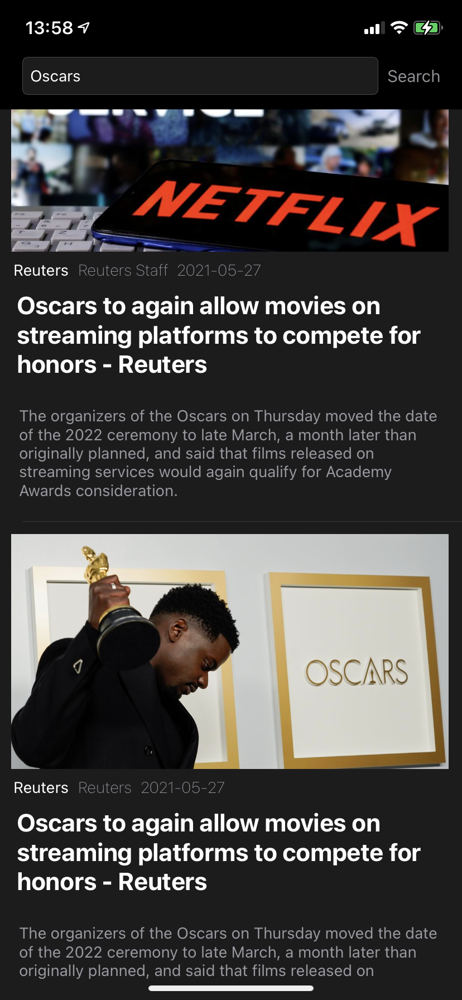
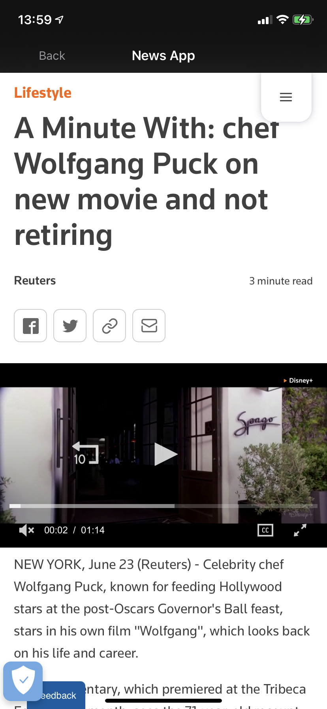
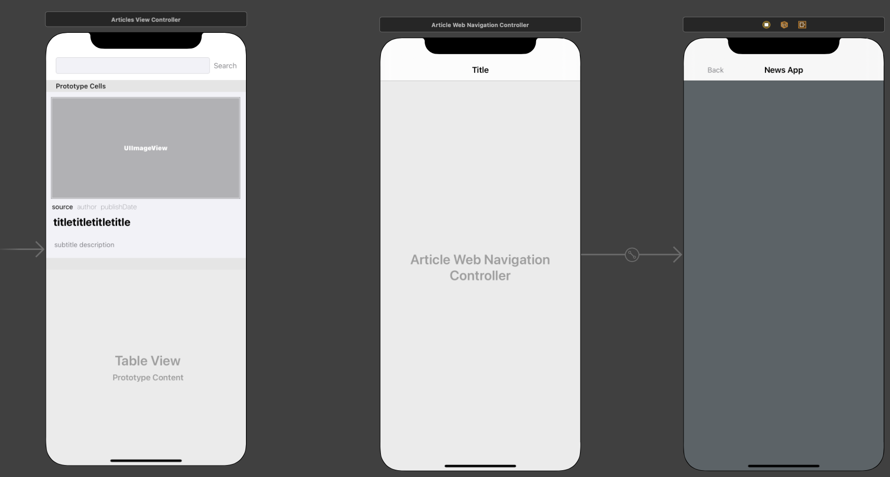

# News mobile app
## Introduction
This is a news mobile app powered by the <a href="https://newsapi.org">NewsAPI</a>! It delivers the newest articles to the user while giving the ability to search through articles by a given keyword.
The user sees a list of articles with their title, subtitle, source, author, published date and image.
Selecting one of those articles show them in a full screen view directly in the app (without delegating in to Safari).
This app was developed as an example solution for the codemasters "<a href="https://www.codementor.io/projects/mobile/news-mobile-app-atx32p8oq5">News mobile app</a>" project.

## Technologies
The News mobile app was written in Swift using UIKit and WebKit.
WebKit allows to create a web view inside the app which shows the whole article without opening Safari.
The articles itself are deliver using the <a href="https://newsapi.org">NewsAPI</a> which gives the ability to filter articles by not only keywords but also by source,
published date, domains or even languages - there is also an option to sort the results by popularity etc.

## Screenshots
On the main screen the user can see the newest articles - downloaded using the APIs keyword "new". On the top of the sceen there is a search bar that can be used to eneter a specific search querry. When the user taps on an article then a fulscreen view with a web view appears - the method of passing the articles URL into this view was shown in the next section. In the article view, there is a navigation bar embedded whis allows the user to go back into the articles list.

  

## Passing the URL to the WebView
The stroy board is very simple and has only three views, where one of them is a navigation controller. Because of that we cant simply instatiate the view with the web view - the navigation bar would be missing.



In the ArticleWebViewController class there is a property which stores the URL to the article that should be displayed.
```swift
@IBOutlet weak var webWindow: WKWebView!  // The outlet to the WebView
var articleURL = String()                 // The URL to the article
    
// When the view did load we have to create a request from the given url and use it to load the WKWebView
override func viewDidLoad() {
    super.viewDidLoad()
    let articleRequest = URLRequest(url: URL(string: articleURL)!)
    webWindow.load(articleRequest)
}
```
To get access to the articleURL property from the main view, this function was defined:

```swift
// This function is called everytime the user select an article from the list
func tableView(_ tableView: UITableView, didSelectRowAt indexPath: IndexPath) {
    // First of all we have to instatiate the navigation controller.
    let nc = storyboard?.instantiateViewController(withIdentifier: "WebArticleNavigationController") as! ArticleWebNavigationController
    // Then using a save guard statement we check if the first child of our navigation controller is a view controoler of the class ArticleWebViewController
    guard let vc = nc.viewControllers.first as? ArticleWebViewController else {
        print("Something went wrong")
        return
    }
    // If we instatiate our view contoller correctly, we can then assign to its property the URL of the selected article (for more see the News.swift file)
    vc.articleURL = articles[indexPath.row].url
    print("So far so good")
    // The last thing is to select the presentation style of the NAVIGATION controller and present it.
    nc.modalPresentationStyle = .fullScreen
    present(nc, animated: true, completion: nil)
}

```
