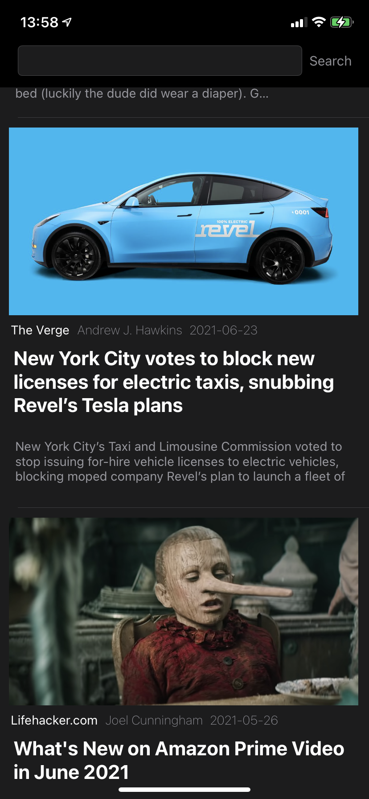

# News mobile app
## Introduction
This is a news mobile app powered by the <a href="https://newsapi.org">NewsAPI</a>! It delivers the newest articles to the user while giving the ability to search through articles by a given keyword.
The user sees a list of articles with their title, subtitle, source, author, published date and image.
Selecting one of those articles show them in a full screen view directly in the app (without delegating in to Safari).
This app was developed as an example solution for the codemasters "<a href="https://www.codementor.io/projects/mobile/news-mobile-app-atx32p8oq5">News mobile app</a>" project.

## Technologies
The News mobile app was written in Swift using UIKit and WebKit.
WebKit allows to create a web view inside the app which shows the whole article without opening Safari.
The articles itself are deliver using the <a href="https://newsapi.org">NewsAPI</a> which gives the ability to filter articles by not only keywords but also by source,
published date, domains or even languages - there is also an option to sort the results by popularity etc.

## Screenshots

  
